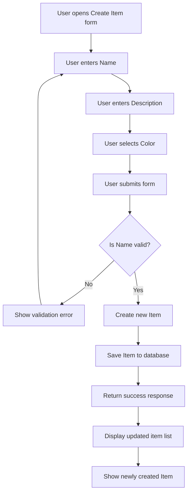

# Experiment: Pure Function - Create Item  
Date: 2026-04-10

## 1. Prompt Provided to AI

Feature: Create Item  

User Story:  
As a wardrobe owner, I want to create a new item with its basic information, so that I can keep my wardrobe collection organized.

Acceptance Criteria:

AC1:  
Given the user is on the item creation form  
When the user enters a valid name, optional description, and selects a color  
Then a new item is created and saved in the system  

AC2:  
Given the user is on the item creation form  
When the user submits the form without entering a name  
Then the system rejects the request and shows a validation error for the name field  

AC3:  
Given a new item has been successfully created  
When the user opens the wardrobe item list  
Then the newly created item appears in the collection with its name, description, and color  

Architecture Flow (Mermaid):

Constraint:  
Write the logic for this feature as a Pure Function. It must have no side effects (stateless) and must return a predictable output.

## 2. Result

The AI partially succeeded on the first attempt.

It correctly:
- Implemented validation logic (checking if Name is empty)
- Returned structured output (success or error result)
- Attempted to separate input and output

However, it also made several mistakes:
- Included database operations (e.g., saving the item)
- Mixed UI concerns such as displaying errors
- Did not fully respect the "no side effects" constraint

## 3. Adjustments Needed

Yes, adjustments were required to get a correct result.

I refined the requirements by:
- Explicitly stating that the function must NOT:
  - Save data to a database
  - Call external services
  - Interact with UI
- Clarifying that the function should ONLY:
  - Validate input data
  - Return either:
    - a new Item object (pure data), or
    - a validation error

I also simplified the interpretation of the Mermaid diagram:
- Ignored UI-related steps (form, navigation, display)
- Focused only on core logic:
  input → validation → result

## 4. Conclusion

This experiment demonstrated that:

- BDD requirements combined with Mermaid diagrams significantly improve AI-generated code quality
- However, AI still tends to introduce side effects unless strict constraints are enforced
- Clear separation of concerns is critical when working with AI-generated code

To successfully generate a Pure Function, it is necessary to:
- Clearly define inputs and outputs
- Explicitly forbid side effects
- Avoid ambiguity in requirements and diagrams

This confirms that an AI-Native engineer must carefully design constraints, context, and structure before relying on AI for code generation.
